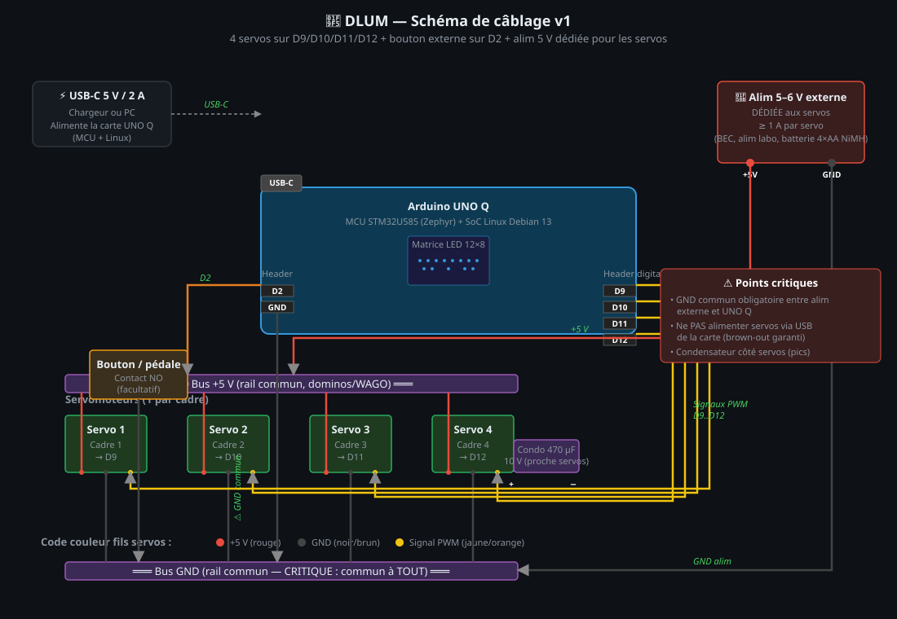

# 🧵 DLUM — Guide de câblage v1

Documentation pour le montage hardware du métier à tisser piloté par
Arduino UNO Q. **Lire avant de brancher quoi que ce soit.**

---

## 🛒 Matériel nécessaire

| Élément | Qté | Notes |
|---|---|---|
| Arduino **UNO Q** | 1 | la carte hybride MCU+Linux |
| Câble **USB-C** | 1 | alim de la carte (depuis PC ou chargeur 5 V / 2 A min) |
| **Servomoteur** 5 V haute torsion (ex. MG996R, DS3225, ou servo 270°) | 4 (jusqu'à 8) | 1 par cadre du métier |
| **Alimentation 5 à 6 V dédiée** pour les servos | 1 | min. 1 A par servo (4 servos = 4 A peak recommandé) |
| **Bouton poussoir** momentané NO **ou** pédale à contact sec | 1 | pour avancer la duite — facultatif (tu peux piloter via UI uniquement) |
| **Condensateur** électrolytique 470 µF / 10 V | 1 | filtre les pics de courant côté alim servos |
| Fils Dupont mâle/femelle / mâle/mâle | qq | pour relier servos et bouton |
| Bornier dominos ou WAGO 222 | 2-3 | pour le bus +5 V / GND commun |

⚠️ **Ne jamais alimenter les servos via le 5 V de la carte UNO Q.**
Sous charge, les servos demandent 500 mA à 1 A chacun → la carte
brown-out et reboot. Il faut une alim 5-6 V externe dédiée.

---

## 🗺️ Schéma de câblage

Voir [`cablage-schema.svg`](cablage-schema.svg) (ouvre-le dans un navigateur
ou un éditeur vectoriel pour zoomer).



---

## 🔌 Brochage des pins UNO Q

| Pin | Fonction | Câblé à |
|---|---|---|
| **D9**  | Servo cadre 1 (PWM) | fil signal du servo 1 (jaune/orange) |
| **D10** | Servo cadre 2 (PWM) | fil signal du servo 2 |
| **D11** | Servo cadre 3 (PWM) | fil signal du servo 3 |
| **D12** | Servo cadre 4 (PWM) | fil signal du servo 4 |
| **D5**  | Servo cadre 5 (si > 4 cadres) | facultatif |
| **D6**  | Servo cadre 6 (si > 4 cadres) | facultatif |
| **D8**  | Servo cadre 7 (si > 4 cadres) | facultatif |
| **D3**  | Servo cadre 8 (si > 4 cadres) | facultatif |
| **D2**  | Bouton externe (INPUT_PULLUP) | une borne du bouton |
| **GND** (n'importe lequel) | masse commune | autre borne du bouton + GND alim externe |
| **USB-C** | Alim de la carte (5 V / 2 A min) | chargeur ou PC |

---

## 🪛 Étapes de montage

### 1. Préparer l'alim externe

```
Alim 5 V externe         Bornier "rail" 5 V
   +V ──────────────────┐
                        ├─── vers fils ROUGES des 4 servos
   GND ─────────────┐   │
                    │   │
                    │   ┌── condensateur 470 µF (–) (+) ──┐
                    │   │                                  │
                    │   │
              Bornier GND (rail) ───── vers fils NOIRS/BRUNS des 4 servos
                                  ───── vers GND de l'UNO Q (FIL CRITIQUE)
                                  ───── vers une borne du bouton
```

⚠️ Le condensateur est polarisé : la patte **−** (côté barre blanche) sur GND,
la patte **+** sur le +5 V. À monter **au plus près des servos**, pas du
côté de l'alim.

### 2. Brancher les servos

Chaque servo a 3 fils (couleurs typiques) :
- **Rouge** = +5 V → bornier rail +5 V
- **Noir ou brun** = GND → bornier rail GND
- **Jaune ou orange** = signal → pin D9 / D10 / D11 / D12 (selon le cadre)

⚠️ La masse **DOIT** être commune entre l'alim externe et le UNO Q,
sinon les signaux PWM n'ont pas de référence. Symptôme : les servos
font n'importe quoi (jitter, position aléatoire, ne bougent pas).

### 3. Brancher le bouton externe (facultatif)

Un bouton momentané NO (normalement ouvert) :
- Borne 1 → **D2** sur l'UNO Q
- Borne 2 → **GND** (n'importe lequel) sur l'UNO Q

Pas de résistance externe nécessaire — le firmware utilise `INPUT_PULLUP`
(résistance interne 30 kΩ qui maintient D2 à 3.3 V au repos).

Quand tu appuies, le contact se ferme → D2 tombe à 0 V → la séquence
avance d'une duite (avec son cycle tassage → levée).

#### Variantes de bouton compatibles
- Bouton de lumière domestique (interrupteur sec NO)
- Pédale guitare/synthétiseur sur jack 6.35 mm (tip = D2, sleeve = GND)
- Pédale industrielle de machine à coudre (avec contact sec)
- Interrupteur au pied avec fil libre

### 4. Alimenter et tester

1. Branche l'**USB-C** de la carte (sans alimenter les servos pour l'instant)
2. La carte boot, la matrice LED affiche "5426 DLUM" qui scrolle
3. Connecte-toi via le navigateur (cf doc réseau)
4. **Onglet Réglages** → Test LED matrix → toute la matrice s'allume
5. **Onglet Réglages** → Test physique des sorties → "Tester sortie D9"
6. ⚡ **Maintenant** branche l'alim externe des servos
7. Le servo D9 doit faire un cycle (haut → bas)
8. Répète pour D10, D11, D12 → vérifie que chaque pin contrôle bien le bon cadre
9. Si l'ordre ne correspond pas à ta numérotation physique des cadres :
   **Onglet Réglages → Mappage cadre logique → physique** pour réassigner

---

## 🛡️ Sécurités intégrées

| Sécurité | Où | Comportement |
|---|---|---|
| **Limite 1–N−1 cadres levés** | Firmware MCU | refuse les commandes qui demandent 0 ou tous les cadres |
| **Watchdog heartbeat** | Firmware MCU | si pas de message Linux pendant 5 s alors qu'un cadre est levé → tout abaisser auto |
| **Anti-rebond bouton** | Firmware MCU + backend | 50 ms stable + 1.5 s lockout |
| **Tassage entre duites** | Backend | tous les cadres descendent N ms (configurable) entre deux levées pour permettre de tasser |

---

## 🔧 Dépannage

| Symptôme | Cause probable |
|---|---|
| Servo immobile | Alim externe pas branchée ou éteinte |
| Servos jittent ou positions erratiques | GND non commun entre alim et UNO Q |
| Brown-out / reboot UNO Q | Servos alimentés via USB de la carte (à éviter), ou alim externe sous-dimensionnée |
| Le bouton avance par 2 ou 3 duites | Problème de contact (résolu par le double anti-rebond, mais vérifier câbles courts) |
| Cadre ne monte pas assez / trop | Régler les angles bas/haut dans Réglages → Calibration servo |
| Mauvais cadre bouge sur une commande | Mapper logique → physique dans Réglages |

---

## 📐 Côtes mécaniques (info)

À adapter selon ton métier :
- **Course typique d'un cadre** : 5 à 10 cm
- **Servo standard** (180°) avec palonnier 4 cm donne ~6 cm de course utile en linéaire (via une bielle)
- **Servo 270°** permet ~9 cm avec le même palonnier
- Pour cadres lourds : **servos linéaires électriques** (plus de course, plus de couple, plus cher)

---

## 📚 Voir aussi

- [`projet.md`](../projet.md) — spec fonctionnelle complète
- [`backend/`](../backend/) — code Python du serveur web
- [`dlum_mcu/`](../dlum_mcu/) — firmware Arduino du MCU
